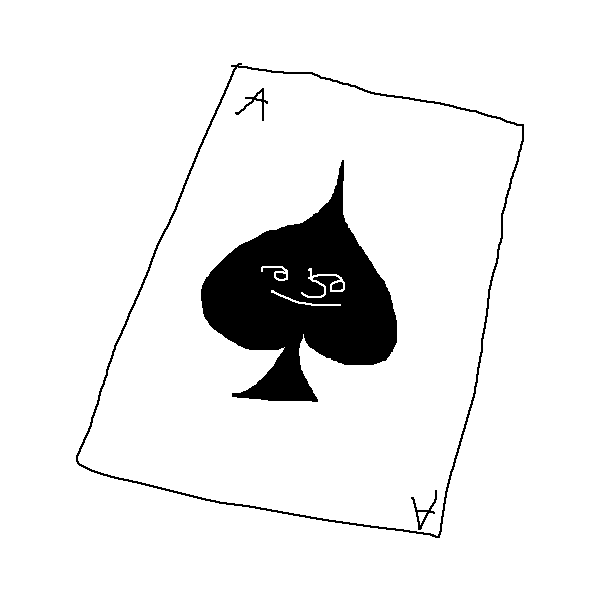

# Poka: the Poker Game

## Table of Contents

- [About](#about)
- [Usage](#usage)
- [To-Do](#todo)
- [Contributors](#contributors)

## About 

Poka is a text-based game of poker.

## Usage 

Just run `main_loop.py` with Python to run the game.

### Prerequisites

You only need Python (preferably newer versions than 3.7.2) to interpret and run this game.

## To-Do 

- More of the game loop.
- Automatic hand detection.
- More game types than just Hold'Em (which is boring.)

## Contributors 

- [underdeveloper](https://github.com/underdeveloper)